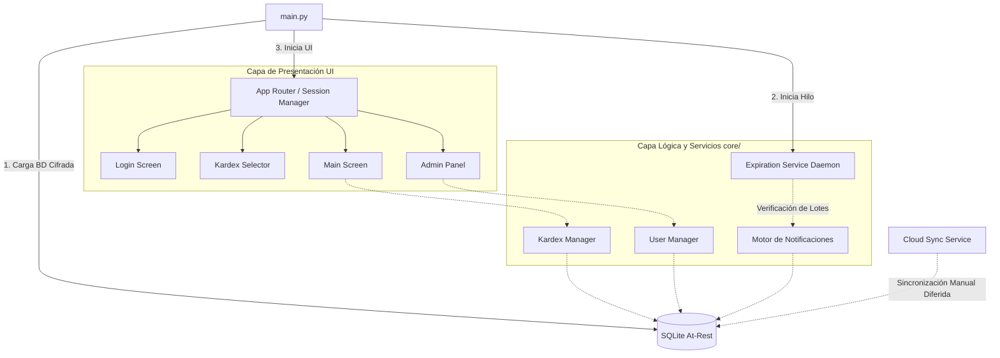

# Kardex Almacén - V3 (Fase 2.1)

## 📌 Resumen del Proyecto
**Kardex Almacén** es un sistema de gestión de inventarios (Kardex), control de lotes y despachos diseñado específicamente para entornos de operatividad aislada. El sistema provee control de accesos, gestión de caducidades, paneles de administración y auditoría de movimientos sin depender de conectividad externa.

---

## 🏗️ Arquitectura y Estructura Completa

La aplicación sigue una arquitectura **Modular basada en Capas** adaptada para Escritorio (Desktop MVC). Todo el estado se mantiene en un router (`AppRouter`) que coordina la interfaz gráfica (UI), mientras que la lógica pesada y bases de datos se abstraen en la capa `core`.

### Bosquejo de Arquitectura (Componentes y Flujos)



---

## 📂 Estructura de Directorios

```text
Kardex-Almacen-V3/
├── main.py                # Punto de entrada de la aplicación y enrutador.
├── core/                  # [Capa Lógica] Algoritmos y datos.
│   ├── database.py        # Configuración de base de datos local y cifrado.
│   ├── managers/          # Gestores de Lógica de Negocio (Kardex, Usuarios).
│   └── services/          # Servicios independientes (Alertas, Cloud Sync, PDF).
└── ui/                    # [Capa de Presentación]
    ├── screens/           # Ventanas raíz del enrutador (Login, Admin, Main).
    ├── windows/           # Ventanas de procesos (Recepciones, Vales, Salidas).
    ├── modals/            # Popups de interacción bloqueante (Categorías, Zonas).
    ├── components/        # Elementos estéticos y reciclables (Toast, Tooltips).
    ├── admin_views/       # Pestañas internas del Panel de Administración.
    └── assets/            # Imágenes, íconos y assets (incluidos los de empaquetado/instalador).
```

---

## 🔄 Ciclos, Iteraciones y Flujos Internos

La aplicación opera a través de múltiples ciclos asíncronos y flujos bloqueantes para garantizar rendimiento:

1. **Ciclo de Vida UI (Main Loop):**
   - El entorno se mantiene vivo mediante `root.mainloop()`.
   - **Iteraciones de Pintado:** Tkinter repinta e itera sobre los eventos del usuario (clics, teclas). Toda llamada a base de datos dentro de la UI trata de ser breve para no "congelar" este ciclo.

2. **Ciclo de Verificación de Vencimientos (Daemon Thread):**
   - Al arrancar, el `ExpirationService` crea un hilo paralelo.
   - **Iteración:** Consulta todos los `active_lots` (Lotes Activos), itera fila por fila verificando la diferencia entre `datetime.now()` y la `expiration_date`.
   - Si quedan `<= 15 días`, se inyectan alertas al buzón (`messages`) de la base de datos de manera autónoma y silenciosa.

3. **Ciclo de Enrutamiento (Navegación):**
   ```mermaid
   stateDiagram-v2
       [*] --> Login
       Login --> AdminPanel : Si es Administrador
       Login --> SelectorKardex : Si es Invitado/Operario
       SelectorKardex --> MainScreen : Al elegir Kardex
       MainScreen --> SelectorKardex : Cambiar Kardex
       AdminPanel --> Login : Logout
       MainScreen --> Login : Logout
   ```

---

## 📡 Justificación Arquitectónica: ¿Por qué NO usar la Nube? (Offline-First)

En la actualidad, el estándar de la industria es alojar las bases de datos en la Nube (AWS, Firebase, Google Cloud). Sin embargo, este proyecto se estructuró con **SQLite Integrado y Almacenamiento Local (Offline-First)** por una razón de peso operativo:

1. **Aislamiento de Señal (Cero Conectividad):**
   - El despliegue de la aplicación ocurre en almacenes e infraestructuras cerradas donde las paredes bloquean por completo la señal de internet y la conectividad WiFi/4G.
   - Una arquitectura en la nube (SaaS) habría causado un **100% de inoperatividad** al no poder registrar entradas/salidas en el momento real de las operaciones de almacén.

2. **Alta Disponibilidad y Baja Latencia:**
   - Todo registro, consulta y guardado es atómico e instantáneo al estar en el mismo disco, optimizando la lectura por escáner o teclado rápido.

3. **Estrategia "Sincronización Diferida" (`cloud_sync.py`):**
   - El sistema reconoce la eventual necesidad de un respaldo. Por ello, la arquitectura contempla un módulo `Cloud Sync`, que permite que el dispositivo, una vez sea movilizado a una zona con señal, pueda sincronizar por lotes (Batch Sync) sus datos hacia un almacenamiento central, manteniendo lo mejor de ambos mundos.

---

## 🚀 Proyecciones Futuras (Escalabilidad)

Al estar el código desacoplado (UI separada de Base de Datos y Servicios), la "Fase 3" o posteriores pueden incluir sin refactorizaciones masivas:

- **Red de Área Local (LAN):** Transformar `database.py` para que lea de un servidor PostgreSQL alojado en una PC "Maestra" dentro del almacén conectado por cable Ethernet, permitiendo múltiples computadoras esclavas sin depender de internet.
- **Reporting Automático:** El `ExpirationService` puede ampliarse para usar iteraciones periódicas (ej. cada hora) en background para auto-generar reportes en PDF y guardarlos en una carpeta designada.
- **Micro-actualizaciones (OTA offline):** A través del empaquetador del instalador, inyectar un actualizador de binarios que corra scripts de migración SQLite de forma invisible para el usuario.
